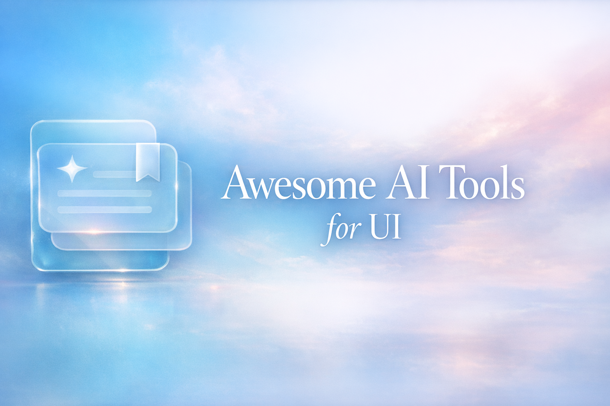

 
 

    <strong>Curated collection of awesome AI tools for building beautiful UI and UX.</strong>
     
     

# Awesome AI Tools for UI

⭐️ = Editor's Choice

Know a cool tool that's not listed? [Create a PR](../../pulls) or [message me on X](https://x.com/o1maxim).

## Contents

- [Skills](#skills)
- [Apps](#apps)
- [MCP Servers & Plugins](#mcp-servers--plugins)
- [Design Tools](#design-tools)
- [Resources](#resources)

## Skills

> AI agent skills that enhance code editors and coding assistants with design intelligence.

- ⭐️ [Impeccable](https://impeccable.style/?utm_source=awesome-ai-tools-for-ui) - 20 design commands that teach your AI agent about typography, spacing, and visual hierarchy.
- [UserInterface.wiki Skill](https://www.userinterface.wiki/skill?utm_source=awesome-ai-tools-for-ui) - 152 UI design rules packaged as a skill file for coding assistants.
- [UI UX Pro Max Skill](https://github.com/nextlevelbuilder/ui-ux-pro-max-skill?utm_source=awesome-ai-tools-for-ui) - Generates design systems (colors, typography, layouts) based on your project type and framework.
- [Anthropic Frontend Design Skill](https://github.com/anthropics/skills/tree/main/skills/frontend-design?utm_source=awesome-ai-tools-for-ui) - Teaches Claude to build frontend UIs with strong visual direction instead of generic defaults.
- [Make Interfaces Feel Better](https://github.com/jakubkrehel/make-interfaces-feel-better?utm_source=awesome-ai-tools-for-ui) - Agent skill that teaches small design engineering details that compound into better interfaces.
- [shadcn/ui Skills](https://ui.shadcn.com/docs/skills?utm_source=awesome-ai-tools-for-ui) - Gives your AI assistant context about your shadcn/ui setup so it generates correct component code.
- [Web Design Guidelines Skill](https://github.com/vercel-labs/agent-skills/blob/main/skills/web-design-guidelines/SKILL.md?utm_source=awesome-ai-tools-for-ui) - Checks your UI code against web design best practices and flags violations.
- [Emil Kowalski Skill](https://github.com/emilkowalski/skill?utm_source=awesome-ai-tools-for-ui) - Skill file based on Emil Kowalski's UI articles, aimed at designers and engineers building better interfaces.
- ⭐️ [Taste Skill](https://www.tasteskill.dev/?utm_source=awesome-ai-tools-for-ui) - Open-source SKILL.md that stops AI agents from producing cookie-cutter frontend designs.
- [Designer Skills Collection](https://github.com/Owl-Listener/designer-skills?utm_source=awesome-ai-tools-for-ui) - Pack of skills and commands — from research to systems, UI, interaction, and delivery.
- [TypeUI Design Skills](https://www.typeui.sh/design-skills?utm_source=awesome-ai-tools-for-ui) - Collection of UI designs with downloadable `skill.md` files.
- [YC Web Design Strategy Skill](https://github.com/maxbogo/yc-web-design-strategy-skill?utm_source=awesome-ai-tools-for-ui) - Web design and strategy principles from YC's Design Review series, packaged as a skill.
- ⭐️ [Swiss Design System](https://swiss.ziki.boo/?utm_source=awesome-ai-tools-for-ui) - Teaches AI agents Swiss design principles through grotesque typography, disciplined grids, restrained color, and Tailwind patterns.
- [Bencium Marketplace](https://github.com/bencium/bencium-marketplace?utm_source=awesome-ai-tools-for-ui) - Claude Code plugin marketplace with skills for design, architecture, productivity, typography, and code review.
- [Three.js Skills](https://github.com/CloudAI-X/threejs-skills?utm_source=awesome-ai-tools-for-ui) - Collection of Three.js skills covering scenes, geometry, lighting, shaders, loaders, animation, and interaction.
- [Awesome DESIGN.md](https://github.com/VoltAgent/awesome-design-md/?utm_source=awesome-ai-tools-for-ui) - Curated collection of DESIGN.md files inspired by developer-focused websites.
- [StyleSeed](https://github.com/bitjaru/styleseed?utm_source=awesome-ai-tools-for-ui) - Design rules and slash-command skills that give agents design judgment — coherence, hierarchy, UX-writing.
- [Claude Code Design Review Workflow](https://github.com/OneRedOak/claude-code-workflows/tree/main/design-review?utm_source=awesome-ai-tools-for-ui) - Templates, subagent prompt, and slash command for automated design reviews against frontend changes.
- [Huashu Design](https://github.com/alchaincyf/huashu-design?utm_source=awesome-ai-tools-for-ui) - HTML-native design skill for generating prototypes, slides, animations, and design reviews from agent prompts.
- [Nothing Design Skill](https://github.com/dominikmartn/nothing-design-skill?utm_source=awesome-ai-tools-for-ui) - Claude Code skill for producing Nothing-inspired monochrome, typographic, industrial UI.
- [Hallmark](https://github.com/nutlope/hallmark?utm_source=awesome-ai-tools-for-ui) - Design skill for Claude Code, Cursor, and Codex that audits and generates UI against anti-slop design gates.
- [Material Design 3 Skill](https://github.com/hamen/material-3-skill?utm_source=awesome-ai-tools-for-ui) - Portable Material Design 3 skill covering tokens, theming, 30+ components, responsive layout, and MD3 audits.

## Apps

> AI-powered applications for designing and building user interfaces.

- ⭐️ [21st.dev](https://21st.dev/home?utm_source=awesome-ai-tools-for-ui) - UI component library and templates for building AI-powered products.
- [AI Website Cloner](https://github.com/JCodesMore/ai-website-cloner-template?utm_source=awesome-ai-tools-for-ui) - Clone any website into a Next.js codebase with one command using AI agents.
- [Superdesign](https://app.superdesign.dev/?utm_source=awesome-ai-tools-for-ui) - AI design tool for generating interfaces in the browser.
- ⭐️ [Variant](https://variant.com/?utm_source=awesome-ai-tools-for-ui) - Scroll through AI-generated design variations for your ideas.
- [Stitch by Google](https://stitch.withgoogle.com/?utm_source=awesome-ai-tools-for-ui) - Google's AI design tool for creating UIs from prompts.
- [Open Design](https://github.com/nexu-io/open-design?utm_source=awesome-ai-tools-for-ui) - Local-first, open-source alternative to Claude Design for generating prototypes, slides, images, and videos.
- [Khroma](https://www.khroma.co/?utm_source=awesome-ai-tools-for-ui) - Learns your color preferences and generates palettes you can search and save.
- [Noyzzi](https://noyzzi.com/?utm_source=awesome-ai-tools-for-ui) - Growing collection of interactive designs with prompts you can copy and adapt.
- [Design Resources for AI Agents](https://styles.refero.design/ai-agents/design-resources?utm_source=awesome-ai-tools-for-ui) - Curated directory of DESIGN.md resources and design references for AI agents.
- [prompt-kit](https://www.prompt-kit.com/?utm_source=awesome-ai-tools-for-ui) - Accessible, customizable component primitives for AI interfaces, including prompt inputs, messages, reasoning, and tool views.

## MCP Servers & Plugins

> Model Context Protocol servers and plugins that add UI research and design workflows to AI editors.

- [Magic MCP](https://github.com/21st-dev/magic-mcp?utm_source=awesome-ai-tools-for-ui) - Generate UI components from text prompts inside Cursor, Windsurf, and VSCode.
- [UI Layouts MCP](https://www.ui-layouts.com/mcp?utm_source=awesome-ai-tools-for-ui) - Lets AI editors search and use real UI components instead of guessing the code.
- [Lazyweb](https://www.lazyweb.com/?utm_source=awesome-ai-tools-for-ui) - MCP server and skills that help agents research real app screens before designing UI.
- [Design and Refine](https://github.com/0xdesign/design-plugin?utm_source=awesome-ai-tools-for-ui) - Claude Code plugin for generating, comparing, and refining multiple UI variations in your codebase.
- [Interface Design](https://github.com/Dammyjay93/interface-design?utm_source=awesome-ai-tools-for-ui) - Claude Code plugin for remembering interface decisions across sessions and keeping UI systems consistent.
- [UIZZE](https://uizze.com/?view=agent&utm_source=github&utm_medium=directory&utm_campaign=github_awesome_ai_tools_for_ui_v1&utm_content=mcp_entry) - Helps Codex avoid generic AI UI by grounding it in real web and iOS references, with design-contract, validation, audit, and critique tools via MCP.

## Design Tools

> Not AI-powered, but valuable tools for UI/UX work.

- [FontCrafter](https://arcade.pirillo.com/fontcrafter.html?utm_source=awesome-ai-tools-for-ui) - Turn your handwriting into an installable font in the browser. Exports OTF, TTF, WOFF2.
- [SVG Loaders](https://magecdn.com/tools/svg-loaders?utm_source=awesome-ai-tools-for-ui) - 100+ open-source animated SVG loading spinners (MIT).
- [SVG Backgrounds](https://www.svgbackgrounds.com/set/free-svg-backgrounds-and-patterns/?utm_source=awesome-ai-tools-for-ui) - Free SVG backgrounds and patterns you can customize.
- [Realtime Colors](https://www.realtimecolors.com/?utm_source=awesome-ai-tools-for-ui) - Preview color palettes and typography on a live website mockup.
- [Transitions.dev](https://transitions.dev/?utm_source=awesome-ai-tools-for-ui) - Copy-and-paste transition patterns for common web app interactions.
- [Beautiful HTML Templates](https://github.com/zarazhangrui/beautiful-html-templates?utm_source=awesome-ai-tools-for-ui) - Agent-ready library of reusable HTML slide templates for generating polished decks.
- [daisyUI](https://daisyui.com/?utm_source=awesome-ai-tools-for-ui) - Tailwind CSS component library with semantic class names, themes, and an official MCP server for AI editors.
- [Paper Shaders](https://github.com/paper-design/shaders?utm_source=awesome-ai-tools-for-ui) - Zero-dependency canvas shaders for adding customizable animated backgrounds, textures, and masked effects to websites.
- [Pryzm](https://www.pryzm.design/?utm_source=awesome-ai-tools-for-ui) - Browser-based visual studio for creating original backgrounds and textures for websites, templates, and designs.
- [Logosystem](https://logosystem.co/?utm_source=awesome-ai-tools-for-ui) - Curated logo inspiration gallery with 1,200+ static and animated logos.
- [Ditther](https://www.ditther.com/?utm_source=awesome-ai-tools-for-ui) - Free browser tool for dither, halftone, ASCII, pixel, and video effects.

## Resources

> Learning materials, design references, and inspiration for UI/UX.

- [Laws of UX](https://lawsofux.com/?utm_source=awesome-ai-tools-for-ui) - Psychology-backed design principles for better user interfaces.
- [UserInterface.wiki](https://www.userinterface.wiki/?utm_source=awesome-ai-tools-for-ui) - Wiki covering UI design, animation, motion, and typography fundamentals.
- [Craftwork](https://craftwork.design/curated/websites/?utm_source=awesome-ai-tools-for-ui) - Curated website designs and premium design resources (UI kits, illustrations, mockups).
- [Zajno Motion](https://motion.zajno.com/?utm_source=awesome-ai-tools-for-ui) - Interactive collection of motion-heavy web experiences for animation and interaction inspiration.
- ⭐️ [The Shape of AI](https://www.shapeof.ai/?utm_source=awesome-ai-tools-for-ui) - UX patterns for designing interfaces that use AI.
- [Delightful frontend](https://developers.openai.com/blog/designing-delightful-frontends-with-gpt-5-4) - Practical techniques for steering AI toward polished frontend designs.
